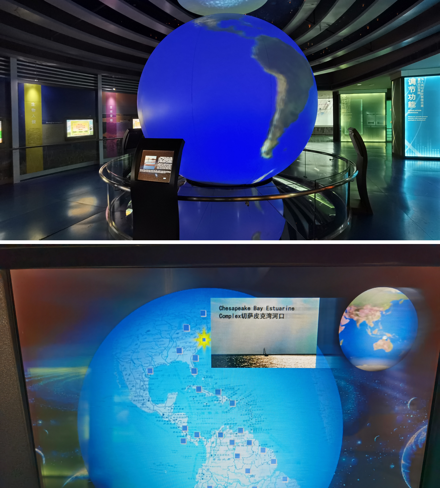

# thesis-project
 This is a repo for Major Studio 2 class and its affiliated thesis project.

 ## Research Question

### Updated on Thu Jan 28

### Concept Alternatives
1. Educational Data Interactive System in VR Environments

## Field Trip on Feb 4 
I visited National Wetland Museum of China today to get some insights from settings in the real museum.  

### the Structure of Wetland Ecosystem

### the Wall of Specimens

### the Miniature Replicas of the Species in the Representative Biosphere
#### A Micro-Landscape of the Tarim River Populus Euphratica Forest Wetland (China)

#### A Micro-Landscape of the Bald Cypress Swamps (USA) with interactive tables

### A Globe Installation with Interactive Tables of the Key Wetland Distribution

### Storyboard and Wireframe: Updated on Tue Feb 1

In-class Feedback (Thanks the support from Lee Kuczewski): 
- Focus on the data driven visualization pieces — the other drivers (such as tools of Computer Vision and AR) — might be secondary in terms of scope (but could provide insights as well). =
- It’s important to think about other personas such as the director of the museum — The director might have a different set of needs in terms of finding specific information on this app while giving a presentation to others (such as funders). 
- The final question was around feasibility and focusing in on a place to start.