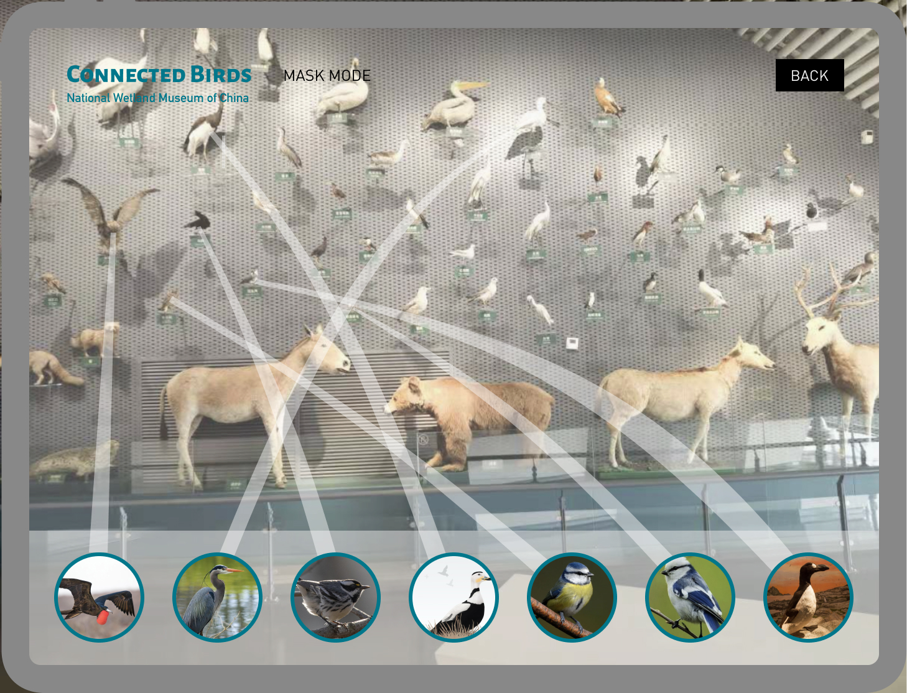

# Connected Birds
### A framework to expand museums' stories of displayed specimens through a digital-physical fusion strategy

By Zhibang Jiang

## Research Question

### The Mindmap
### updated on Thu Jan 28

#### Concept Alternatives
1. Educational Data Interactive System in VR Environments

## The Field Trip on Feb 4 
I visited National Wetland Museum of China today to get some insights from settings in the real museum.  

### the Structure of Wetland Ecosystem

### the Wall of Specimens

### the Miniature Replicas of the Species in the Representative Biosphere
#### A Micro-Landscape of the Tarim River Populus Euphratica Forest Wetland (China)

#### A Micro-Landscape of the Bald Cypress Swamps (USA) with interactive tables

## Storyboard and Wireframe
### Updated on Tue Feb 1

### In-class Feedback (Thanks the support from Lee Kuczewski): 
#### Daniel's Response
- Focus on the data driven visualization pieces — the other drivers (such as tools of Computer Vision and AR) — might be secondary in terms of scope (but could provide insights as well). It’s important to think about other personas such as the director of the museum — The director might have a different set of needs in terms of finding specific information on this app while giving a presentation to others (such as funders). The final question was around feasibility and focusing in on a place to start.
#### Chat Comments
- Sherry Manzar: Those birds clusters look like a great use case for the t-SNE technique discussed in the Seth Kranzler video!

#### Resource
- [Amazon Rekognition](https://aws.amazon.com/cn/rekognition/)
- [MachineLearning_SethKranzler_Lecture](https://drive.google.com/file/d/1PqMxu4bEn8oqGDxb3NtvgrGZG4rdPEdE/view)

## Prototype
### Updated on Tue Mar 2
[Interactive one](https://www.figma.com/proto/6CiVh0Lop040n0WVDhEPIH/Major-Studio-1-Project-3?node-id=405%3A2102&viewport=790%2C90%2C0.40976792573928833&scaling=min-zoom)
### Screenshots

### In-class Feedback
#### Daniel's Response
Excellent, this is very impressive. What your deck currently does is really show in a very multifaceted and very convincingly that it's feasible from your end. 

There are gaps that you identify both educationally in terms of what we see but also who is a stakeholder, who makes the decision in terms of adopting something like this in a museum exhibit. So there's very few questions right you kind of pre-out productively answer them and then there's a Plan A and the Plan B already to be deployed. So what's the gap on your project is that you kind of push forward and see if all of these feasibility components are actually on table for you because I am convinced and excited enough that I want you to make this an actual project and not just a pitch.

You have visited Xixi Museum. That's the one. You have a two-way street that you will have to be enabling their collection to be updated like you've seen and maybe the AR piece is the one that falls by the wayside (半途而废) first that's where you have a roadmap or a runway where you can say you have this amount of time and this amount of budget in terms of redigitizing, getting QR codes hanging. And what it means and so suddenly this whole thesis doesn't talk about birds only, it talks about education around species. And you're saying connect the birds maybe they are related, you have to talk the language of evolution more than world wide web. 

But I think it's all here and I would love your first sprint to strategically pick one of those harder problems here and build that because I see already that you're having actual data, run some of your prototypes and you're quite far ahead in that regard but also you are not safe in regards to scope creep (范围蔓延) and that certain things will be harder to do. So it's really just listening to your own brief and trying to run with this two-way communication I think what needs to be done here.

The last two screens about AR are extremely convincing certainly, in terms of call outs and how you would look at them how they're connected, definitely a sales moment. But if this is the first thing that falls to the wayside, the other components need to stand on their own as well.

> Note: Scope creep in project management refers to changes, continuous or uncontrolled growth in a project’s scope, at any point after the project begins. This can occur when the scope of a project is not properly defined, documented, or controlled. It is generally considered harmful. 

#### Chat Comments
- Daniel Sauter: Dominant color research, looks like you and Luella need the same to implement.
- David Malary: I really like the color aspect! I wonder if you can compare that with the habitats, to see if birds of similar colors live in similar habitats or not?
- Justin Kraus: I appreciate the specificity of wetland birds. I think maybe a primer on what type of bird generally inhabits this habitat would provide relevant early context.
- Serry Manzar: I really like how each interaction has a purpose and contributes to a clear story.
- Lee Kuczewski: Beautiful interactivity, Zhibang! I love how clear this is regarding the ecosystem approach - with a focus on accessibility. Great use of the evolutionary tree as bringing the species together.
### External Discussion
- #### [Liwenhan Xie](https://shellywhen.github.io/), a PhD student at HKUST working on data visualization
    On the gallery view, a 'sort by' feature could be added. A user could change the order of the birds or reorganize them by using this feature. This feature provides the possibility of layout in multiple dimensions, such as sorting by name, color, conservation status, an analogue layout of the physical setting and so on. In each dimension of sorting, a specific encoding strategy embedded in the stroke and corresponding legends could be created.

- #### [Yuning Chan](https://alienyuning.com/), a graduate student in the IDE program at Royal College of Art
    Yuning has a background in Environmental Science, and she focuses on the field of biodesign. She provides valuable suggestions from the perspective of living organisms and nature. First, she thinks the conversations could not only be technically but also a transformation of identities between humans and species/specimens. We could enable humans to observe and understand the world through the eyes/lens of a bird, traveling through different ecosystems. Also, she points that naïve analogies (Hofstadter et al. 2013) could be used to eliminate the barriers between people and data visualization and make the interface to be less like a 'Database'. One of the forms of naïve analogies is to imitate the bird relations, such as food chain and ecology relationships, through the interactivity of social media platforms in human society, which builds proximity and enhances comprehension via a familiar formula or language. Naïve analogies matter, because Yuning believes the step before "making things more accessible" is to spark people interests and encourage or motivate them to access it (make them want to do so).

## References
- Hofstadter, Douglas R., and Emmanuel Sander. Surfaces and essences: Analogy as the fuel and fire of thinking. Basic Books, 2013.
### Critical Histories of Natural History, Natural History Museums, Cultures of Display
- Asma, Stephen T. Stuffed animals & pickled heads: The culture and evolution of natural history museums. Oxford University Press, USA, 2003.
- Hooper-Greenhill, Eilean, ed. Museum, media, message. Routledge, 2013.
- Turner, Hannah. Cataloguing Culture: Legacies of Colonialism in Museum Documentation. UBC Press, 2020.
### The History of Museum Technology 
- Thorburn, David, and Henry Jenkins, eds. Rethinking media change: The aesthetics of transition. Mit Press, 2004.
- Griffiths, Alison. Shivers down your spine: Cinema, museums, and the immersive view. Columbia University Press, 2008.
### Museum Technique + DataVis
- Ma, Joyce, Kwan-Liu Ma, and Jennifer Frazier. "Decoding a Complex Visualization in a Science Museum–An Empirical Study." IEEE transactions on visualization and computer graphics 26, no. 1 (2019): 472-481.
- Hinrichs, Uta, Holly Schmidt, and Sheelagh Carpendale. "EMDialog: Bringing information visualization into the museum." IEEE transactions on visualization and computer graphics 14, no. 6 (2008): 1181-1188.
- Horn, Michael S., Brenda C. Phillips, Evelyn Margaret Evans, Florian Block, Judy Diamond, and Chia Shen. "Visualizing biological data in museums: Visitor learning with an interactive tree of life exhibit." Journal of Research in Science Teaching 53, no. 6 (2016): 895-918.
- Grinter, Rebecca E., Paul M. Aoki, Margaret H. Szymanski, James D. Thornton, Allison Woodruff, and Amy Hurst. "Revisiting the visit: Understanding how technology can shape the museum visit." In Proceedings of the 2002 ACM conference on Computer supported cooperative work, pp. 146-155. 2002.
- 刘健. "博物馆数据可视化的探索与实践——以上海博物馆数字化建设为例." 收藏 2 (2019).

## Case Studies
- [HEADHUNT, National Portrait Gallery, Australia](https://www.portrait.gov.au/content/headhunt)
- [SMARTIFY: Explore a world of art and culture](https://smartify.org/)
- [Lessons in bringing birds to life: an Augmented Reality experiment at the Museum of Natural History](https://medium.com/neeeu/lessons-in-bringing-birds-to-life-an-augmented-reality-experiment-at-the-museum-of-natural-history-21d2855c4c68)
- [Five Augmented Reality Experiences That Bring Museum Exhibits to Life](https://www.smithsonianmag.com/travel/expanding-exhibits-augmented-reality-180963810/)
- [Learn more about the apps offered by the American Museum of Natural History.](https://www.amnh.org/apps)
- [How museums are using immersive digital experiences (pre- and post-pandemic)](https://econsultancy.com/how-museums-are-using-immersive-digital-experiences/)
- [the work Seb Chan has done at the Cooper Hewitt and the Australian Center for the Moving Image](https://sebchan.medium.com/)
- [BLOGS FROM THE NATURAL HISTORY MUSEUM](https://naturalhistorymuseum.blog/category/digital-media-at-the-nhm/)
- [the syllabi for Elaine Ayers’ classes](https://elaineayers.com/Work)