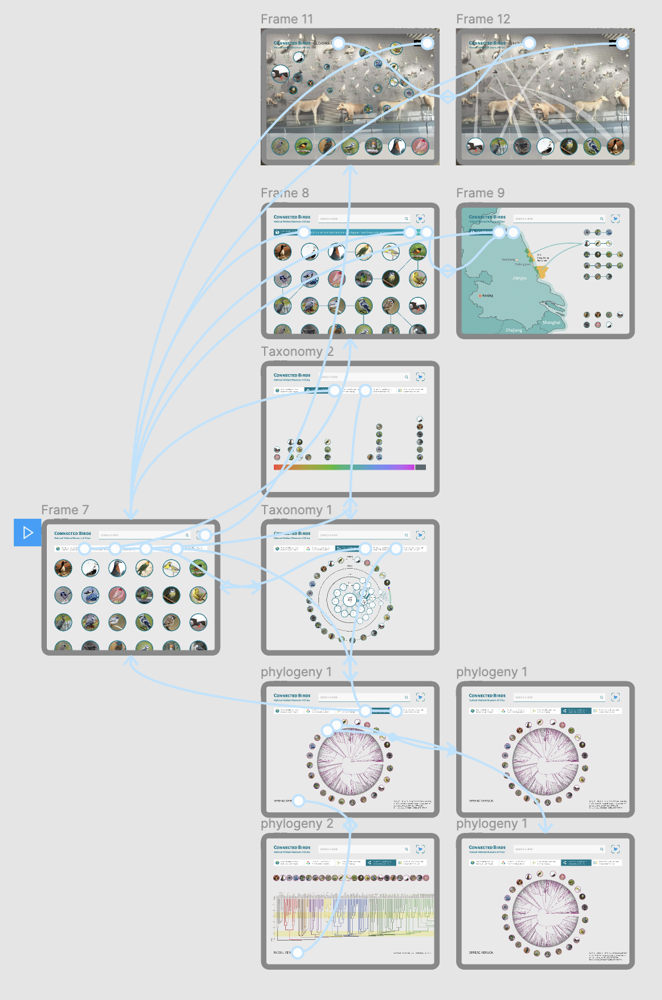

# thesis-project
 This is a repo for Major Studio 2 class and its affiliated thesis project.

## Research Question

### The Mindmap
### updated on Thu Jan 28

#### Concept Alternatives
1. Educational Data Interactive System in VR Environments

## The Field Trip on Feb 4 
I visited National Wetland Museum of China today to get some insights from settings in the real museum.  

### the Structure of Wetland Ecosystem

### the Wall of Specimens

### the Miniature Replicas of the Species in the Representative Biosphere
#### A Micro-Landscape of the Tarim River Populus Euphratica Forest Wetland (China)

#### A Micro-Landscape of the Bald Cypress Swamps (USA) with interactive tables

## Storyboard and Wireframe
### Updated on Tue Feb 1

#### In-class Feedback (Thanks the support from Lee Kuczewski): 
- Focus on the data driven visualization pieces — the other drivers (such as tools of Computer Vision and AR) — might be secondary in terms of scope (but could provide insights as well). =
- It’s important to think about other personas such as the director of the museum — The director might have a different set of needs in terms of finding specific information on this app while giving a presentation to others (such as funders). 
- The final question was around feasibility and focusing in on a place to start.
- Sherry Manzar: Those birds clusters look like a great use case for the t-SNE technique discussed in the Seth Kranzler video!

#### Resource
- [Amazon Rekognition](https://aws.amazon.com/cn/rekognition/)
- [MachineLearning_SethKranzler_Lecture](https://drive.google.com/file/d/1PqMxu4bEn8oqGDxb3NtvgrGZG4rdPEdE/view)

## Prototype
### Updated on Tue Mar 2
[Interactive one](https://www.figma.com/proto/6CiVh0Lop040n0WVDhEPIH/Major-Studio-1-Project-3?node-id=405%3A2102&viewport=790%2C90%2C0.40976792573928833&scaling=min-zoom)
### Screenshots

