# Connected Specimens <!-- omit in toc -->

## A low-cost framework for museums to expand the stories of displayed specimens<!-- omit in toc -->

By [Zhibang Jiang](https://zhibang.design) | Video | [Live Demo](https://connected-species.com/) | [Code Repo](https://github.com/gitacoco/connected_species) | Written Thesis | [Parsons 2021 Data Visualization](http://parsons.nyc/thesis-2021/)

Submitted in partial fulfillment of the requirements for the degree of Master Science in Data Visualization at Parsons School of Design

## Abstract

The specimens nowadays on display in museums are the attempts and efforts of human intelligence to create traces of species that once existed, to represent their appearance, and, for the species that are still here, to resist their disappearance. But there is an experiential divide between the stories offered by museums and visitors’ desire to go further, between digital interfaces and physical settings, and between developed and less developed regions. This project creates a low-cost, data-driven framework that leverages the scalability of digital media and the perceptibility of real-world objects to breathe new life into exhibits and enhance the in-person engagement in museums. The project will first focus on bird species at the National Wetland Museum of China, enhancing visitors' cognitive experience of the specimens through a digital-physical integration strategy. The future vision of the project is to open up to other species datasets and provide APIs and SDKs for further development.

## Preview

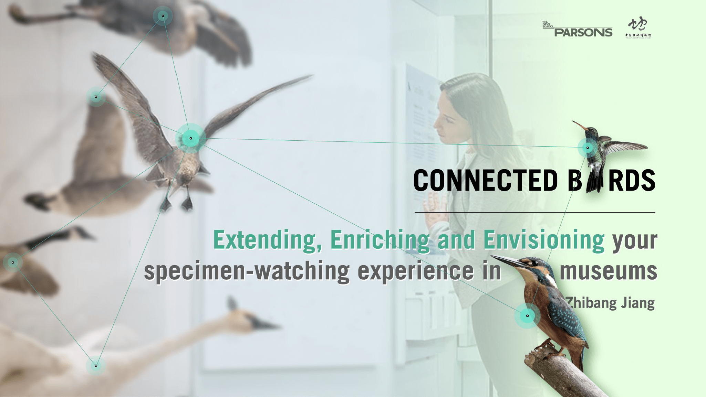

## Acknowledgements

## Feedback <!-- omit in toc -->

- Jan 28: Daniel - In-class Feedback for the Research Question [editing]
- Feb 18: [Daniel - In-class Feedback for the Storyboard and Wireframe](#in-class-feedback-1)
- Mar 02: [Daniel & Classmates - In-class Feedback for the Prototypes](#in-class-feedback-2)
- Mar 10 & 14: [Liwenhan & Yuning - External Feedback for the Prototypes](#external-discussion)
- Mar 30: Daniel - Indivisual Meeting Feedback for the Design Refinement [editing]
- Apr 8: Daniel & Classmates - In-class Feedback for the Design Refinement [editing]
- Apr 13: [Shannon & Classmates - External Feedback for the Design Solution](#feedback)
- Apr 15: Daniel - Indivisual Meeting on the Development Process [editing]
- Apr 20: [Daniel & Alec - Guest Feedback for the Development Process](#guest-feedback)
- Apr 28: [Shannon - Indivisual Meeting on the Final Touches](#indivisual-meeting-feedback-for-final-touches)
- May 04: [MTF Classmates - Breakout-room comments](#breakout-rooms-in-the-final-class)
- May 04: Daniel - Indivisual Meeting on the Presentation [editing]
- May 06: [Daniel, Alec & Ellie - The Feedback for the Final Review](#final-review-feedback)
- May 07: [Chris - Indivisual Meeting on the Presentation](#may-7-individual-meeting)
- May 08: [Shannon - Feedback for the Final Atlas](#shannon-final-atlas-feedback)

## Last-mile to-do List by Date <!-- omit in toc -->

### Tue May 4 <!-- omit in toc -->

- [x] The framework of the data-driven map
- [x] Mock count/filter/sorter/stories footer
- [x] 1 on 1 session with Daniel

### Wed May 5 <!-- omit in toc -->

- [x] Geo component
  - [x] Item list
    - [x] Style the list of items
    - [x] Created the transition of item containers
    - [x] Adjust the direction of the transition of container width
  - [x] Map elements
    - [x] Adjust the position of zoom control
    - [x] Set map bound
    - [x] Constrain vertical scroll at the minzoom level
    - [x] Set the corners of world map
- [x] Transition optimization
  - [x] Optimized the performance of transition: avoiding switch fuction, using ternary operator instead
  - [x] Canvas transition differences between different views (ternary operator)

### Thu May 6 <!-- omit in toc -->

- [x] [Force layout](https://observablehq.com/@dianaow/force-directed-graph-with-circle-packing/2)
  - [x] Force layout in the gallery view
- [x] Video
  - [x] Finishing video script writing (The first edition)
  - [x] 4-min demo video making
- [x] Final review

### Fri May 7 <!-- omit in toc -->

- [x] Submit as the final project for MTF class by noon
- [x] Keynote Preparing
  - [x] Revise the script
  - [x] Write the Promo script
  - [x] Hire a voice actor
  - [x] Proofreading the abstract with Jeanne
  - [x] 1 on 1 session with Chris Bost at 01:00 AM on May 8

### Sat May 8 <!-- omit in toc -->

- [x] Geo component
  - [x] Dataset and data points
    - [x] Request bird sound data
    - [x] Populate data into the map
  - [x] Filters
    - [x] Data filter by clicking items
  - [x] Popup
    - [x] Leaflet popup
    - [ ] Popup styling
    - [x] Media player

### Sun May 9<!-- omit in toc -->

- [ ] Panorama background with Three.js
  - [x] On-location shooting in Xixi Museum
  - [x] Mapping the AR comnnections
  - [ ] reorder the items on the website
- [ ] Prototype of the Threats and Actions view
- [ ] the Conservation view
  - [ ] Force layout in the conservation view
  - [ ] 'Group by' feature in the conservation view
  - [ ] Label of the group
  - [ ] Color encoding of the group pack

### Mon May 10<!-- omit in toc -->

- [ ] New Prototype of Taxo Tree view
- [ ] Prototype of the metadata panel in the gallery view
- [ ] Keynote Preparing
  - [ ] 1 on 1 session with Chris Bost at 22:00 PM
  - [ ] Video Due: 05:00 AM on May 11 Beijing Time

### Tue May 11<!-- omit in toc -->

- [ ] Credit button
  
### No Due Date: Post-keynote Implementation <!-- omit in toc -->

- [ ] Area filter above the map
- [ ] The metadata panel in the gallery view
- [ ] 3D globe in the map view
- [ ] Threats and Actions view
- [ ] Color View
- [ ] Taxo view using Radial Tidy Tree
- [ ] Sorting and Filter features in every view

## To-do List by Component <!-- omit in toc -->

- [ ] Datasets
  - [x] **Apr 27** Modify the birdcode
  - [x] **Apr 27** Add conservation status data
  - [x] **Apr 27** Add common name data
  - [x] **Apr 28** Add population trend data
  - [x] **May 01** Using node.js to request data
  - [x] **May 01** [Threats](https://www.iucnredlist.org/resources/threat-classification-scheme)/[Actions](https://www.iucnredlist.org/resources/conservation-actions-classification-scheme) Data
  - [x] **May 01** Taxonomy Data
  - [ ] Bird song Data
  - [x] **May 02** Request geo distribution data from [BirdLife](http://datazone.birdlife.org/species/requestdis)
- [ ] Fundamental components
  - [ ] Menu
    - [x] **Apr 29** Data-driven menu
    - [x] **Apr 29** Set the `::before`, `::after` effects
    - [x] **Apr 30** Style the menu with icons (spent a whole day)
    - [x] **Apr 25** Set the control bar `fixed`
    - [ ] 'Back to the gallery' button
    - [ ] Search Function
  - [ ] Page footer
    - [ ] Page footer for item counts, sorting & filtering feature, preset stories
  - [x] Webpage Layout
    - [x] ~~Responsive Grid Layout or~~
    - [x] **Apr 25** Embed the webpage into iframe mockup
    - [x] **Apr 25** Resize webpage with locked aspect ratio
    - [ ] Resize webpage for high resolution environments
    - [x] **Apr 29** SVG overflow control => resize SVG `width` and `height` when transitions happen
- [ ] Gallery View
  - [x] List of the items
    - [x] Optimize the performance of SVG image => Resize image
  - [x] Name of the items
    - [x] ~~Normal name instead of sci name~~
    - [x] ~~Toggle word wrap or~~
    - [x] **Apr 25** No labels
  - [ ] Sorting in the gallery view
    - [ ]  Sorting by conservation status
    - [ ]  Color encoding in the stroke
    - [x]  **Apr 29** Add Key Function to avoid disorder id
    - [x]  **Apr 28** Add State management
- [ ] **May 03** Details-on-Demand view
  - [x] **Apr 27** Popup when hovering
  - [ ] Panel for individual species
    - [ ] Force layout transform in the gallery view
    - [ ] Data construction and display strategy
    - [ ] multi-modal: voice of birds
  - [x] ~~The modality for entering a secondary view~~
  - [ ] State lock of selection when views change
- [ ] Macro-level views
  - [ ] **May 02** Grouping View
    - [x] **Apr 26** Learn D3 laybouts
    - [x] **Apr 26** Hierarchical layouts
    - [x] **May 02** Grouping by conservation status
    - [x] **May 03** Created ordinal scale of color based on the depth of nodes
    - [ ] force layout inside pack layout (related work: [Lunar Open Architecture](https://loa.mit.edu/#/Database))
    - [ ] More 'Group By' options: i.e. population trends
  - [x] Geo View
    - [x] Get bird song data with latitude and longitude
    - [x] List panel
    - [x] Map component
    - [ ] Habitat lens (waiting for the responds from BirdLife)
  - [ ] Taxonomy View
    - [ ] taxon node parents
    - [ ] stratify data and layout generater
    - [ ] data management and view transitions
    - [ ] styling
  - [ ] Color-sorting View
  - [ ] **Pending** Evolution Tree: Phylogeny View
    - [ ] Case 1: [OneZoom](http://www.onezoom.org/OZtree/static/OZLegacy/EDGE_birds.htm)
    - [ ] Code: Right-angle phylograms and [circular dendrograms](http://bl.ocks.org/kueda/1036776) with d3
    - [ ] BirdTree.org [phylogeny subsets](https://birdtree.org/subsets/)
    - [ ] [iTOL](https://itol.embl.de/) Interactive Tree of Life
    - [ ] Need more thoughts on Naive Nnalogy
  - [ ] **May 02** Threats & Actions
    - [ ] Data construction: from many-to-many to one-to-many relationships
    - [x] **Apr 29** Transitions from other view
    - [x] **Apr 29** Resize and restyle circle elements during transitions
    - [x] **Apr 29** Change hovering behavior in different views through `swicth` conditionals
- [x] Add Transitions to circles
- [ ] Recognition component
  - [ ] Webpage mock up: iframe page with [panorama](https://pchen66.github.io/Panolens/examples/panorama_infospot.html) background
- [ ] Accessibility
  - [ ] `alt=''` property for buttons and pictures
- [ ] Final touches
- [ ] Keynote Presentation
  - [x] Script Writing
  - [ ] dubbing of script
  - [ ] Video mock up

## Table of Contents <!-- omit in toc -->
<!-- TOC -->
- [Abstract](#abstract)
- [Preview](#preview)
- [Acknowledgements](#acknowledgements)
- [Research & Design](#research--design)
  - [Brainstorming and Research Question](#brainstorming-and-research-question)
    - [In-class feedback](#in-class-feedback)
  - [Field Trip (Feb 4)](#field-trip-feb-4)
    - [The Museum Overview](#the-museum-overview)
    - [the Structure of Wetland Ecosystem](#the-structure-of-wetland-ecosystem)
    - [the Miniature Replicas of the Species in the Representative Biosphere](#the-miniature-replicas-of-the-species-in-the-representative-biosphere)
  - [Storyboard and Wireframe (Feb 18)](#storyboard-and-wireframe-feb-18)
    - [In-class Feedback](#in-class-feedback-1)
  - [Prototype](#prototype)
    - [Screenshots (Mar 2)](#screenshots-mar-2)
    - [In-class Feedback](#in-class-feedback-2)
    - [External Discussion](#external-discussion)
  - [The Whole Story (Apr 13)](#the-whole-story-apr-13)
    - [Slides](#slides)
    - [Feedback](#feedback)
    - [Thoughts on Final Touches](#thoughts-on-final-touches)
      - [Narratively thematic navigations through the collection](#narratively-thematic-navigations-through-the-collection)
      - [Transitions as the connective threads between individual maps](#transitions-as-the-connective-threads-between-individual-maps)
      - [Descriptive commentary reflecting on the mission of each map](#descriptive-commentary-reflecting-on-the-mission-of-each-map)
      - [Accessories to enhance the self-explanatory and intuitive features of the atlas](#accessories-to-enhance-the-self-explanatory-and-intuitive-features-of-the-atlas)
      - [Expanding accessibility for scenarios](#expanding-accessibility-for-scenarios)
    - [Indivisual Meeting Feedback for Final Touches](#indivisual-meeting-feedback-for-final-touches)
  - [References](#references)
    - [Histories of Natural History (Museums), Cultures of Display](#histories-of-natural-history-museums-cultures-of-display)
    - [The History of Museum Technology](#the-history-of-museum-technology)
    - [Museum Technique + DataVis](#museum-technique--datavis)
    - [Cognitive Learning](#cognitive-learning)
    - [Case Studies](#case-studies)
    - [D3 or other examples](#d3-or-other-examples)
    - [Field Knowledge](#field-knowledge)
- [Implementation](#implementation)
  - [Pipeline](#pipeline)
  - [Layered Interfaces](#layered-interfaces)
  - [The Gallery View](#the-gallery-view)
    - [Macro Level: Overview](#macro-level-overview)
      - [Design Review](#design-review)
      - [Development Process](#development-process)
      - [Individual Meeting Feedback](#individual-meeting-feedback)
    - [Micro Level: Details-on-demand](#micro-level-details-on-demand)
      - [Design Review](#design-review-1)
      - [Development Process](#development-process-1)
      - [One-on-one Feedback](#one-on-one-feedback)
      - [Guest Feedback](#guest-feedback)
- [More Feedback](#more-feedback)
  - [Final review feedback](#final-review-feedback)
  - [MTF class](#mtf-class)
    - [Breakout rooms in the final class](#breakout-rooms-in-the-final-class)
    - [Shannon: Final Atlas Feedback](#shannon-final-atlas-feedback)
  - [Chris Bost](#chris-bost)
    - [May 7 Individual Meeting](#may-7-individual-meeting)
- [Branding](#branding)
  - [Keynote Video](#keynote-video)
  - [Landing Page](#landing-page)
- [Written Thesis](#written-thesis)
<!-- /TOC -->

## Research & Design

### Brainstorming and Research Question

updated on Thu Jan 28

#### In-class feedback

### Field Trip (Feb 4)

I visited National Wetland Museum of China on Feb 4 to get some insights from settings in the real museum.

#### The Museum Overview

|   |   |   |
:-------------------------:|:-------------------------:|:-------------------------:
 |  | 

#### the Structure of Wetland Ecosystem

**the Wall of Specimens**

#### the Miniature Replicas of the Species in the Representative Biosphere

- A Micro-Landscape of the Tarim River Populus Euphratica Forest Wetland (China)

- A Micro-Landscape of the Bald Cypress Swamps (USA) with interactive tables

### Storyboard and Wireframe (Feb 18)

#### In-class Feedback

- Daniel's Response
  - Focus on the data driven visualization pieces — the other drivers (such as tools of Computer Vision and AR) — might be secondary in terms of scope (but could provide insights as well). It’s important to think about other personas such as the director of the museum — The director might have a different set of needs in terms of finding specific information on this app while giving a presentation to others (such as funders). The final question was around feasibility and focusing in on a place to start.

- Chat Comments
  - Sherry Manzar: Those birds clusters look like a great use case for the t-SNE technique discussed in the Seth Kranzler video!
  - [Amazon Rekognition](https://aws.amazon.com/cn/rekognition/)
  - [MachineLearning_SethKranzler_Lecture](https://drive.google.com/file/d/1PqMxu4bEn8oqGDxb3NtvgrGZG4rdPEdE/view)

### Prototype

#### Screenshots (Mar 2)

[Interactive Prototype Please Click Here](https://www.figma.com/proto/6CiVh0Lop040n0WVDhEPIH/Major-Studio-1-Project-3?node-id=405%3A2102&viewport=790%2C90%2C0.40976792573928833&scaling=min-zoom)

|   |   |
:-------------------------:|:-------------------------:
 | 
 | 
 | 
 | 
 | 

#### In-class Feedback

- **Daniel's Response**
  
  Excellent, this is very impressive. What your deck currently does is really show in a very multifaceted and very convincingly that it's feasible from your end.
  
  There are gaps that you identify both educationally in terms of what we see but also who is a stakeholder, who makes the decision in terms of adopting something like this in a museum exhibit. So there's very few questions right you kind of pre-out productively answer them and then there's a Plan A and the Plan B already to be deployed. So what's the gap on your project is that you kind of push forward and see if all of these feasibility components are actually on table for you because I am convinced and excited enough that I want you to make this an actual project and not just a pitch.

  You have visited Xixi Museum. That's the one. You have a two-way street that you will have to be enabling their collection to be updated like you've seen and maybe the AR piece is the one that falls by the wayside (半途而废) first that's where you have a roadmap or a runway where you can say you have this amount of time and this amount of budget in terms of redigitizing, getting QR codes hanging. And what it means and so suddenly this whole thesis doesn't talk about birds only, it talks about education around species. And you're saying connect the birds maybe they are related, you have to talk the language of evolution more than world wide web.

  But I think it's all here and I would love your first sprint to strategically pick one of those harder problems here and build that because I see already that you're having actual data, run some of your prototypes and you're quite far ahead in that regard but also you are not safe in regards to scope creep (范围蔓延) and that certain things will be harder to do. So it's really just listening to your own brief and trying to run with this two-way communication I think what needs to be done here.

    > Note: Scope creep in project management refers to changes, continuous or uncontrolled growth in a project’s scope, at any point after the project begins. This can occur when the scope of a project is not properly defined, documented, or controlled. It is generally considered harmful.

  The last two screens about AR are extremely convincing certainly, in terms of call outs and how you would look at them how they're connected, definitely a sales moment. But if this is the first thing that falls to the wayside, the other components need to stand on their own as well.

- **Chat Comments**
  - Daniel Sauter: Dominant color research, looks like you and Luella need the same to implement.
  - David Malary: I really like the color aspect! I wonder if you can compare that with the habitats, to see if birds of similar colors live in similar habitats or not?
  - Justin Kraus: I appreciate the specificity of wetland birds. I think maybe a primer on what type of bird generally inhabits this habitat would provide relevant early context.
  - Serry Manzar: I really like how each interaction has a purpose and contributes to a clear story.
  - Lee Kuczewski: Beautiful interactivity, Zhibang! I love how clear this is regarding the ecosystem approach - with a focus on accessibility. Great use of the evolutionary tree as bringing the species together.
  
#### External Discussion

- [Liwenhan Xie](https://shellywhen.github.io/), a PhD student at HKUST working on data visualization
  
    On the gallery view, a 'sort by' feature could be added. A user could change the order of the birds or reorganize them by using this feature. This feature provides the possibility of layout in multiple dimensions, such as sorting by name, color, conservation status, an analogue layout of the physical setting and so on. In each dimension of sorting, a specific encoding strategy embedded in the stroke and corresponding legends could be created.

- [Yuning Chan](https://alienyuning.com/), a graduate student in the IDE program at Royal College of Art
  
    Yuning has a background in Environmental Science, and she focuses on the field of biodesign. She provides valuable suggestions from the perspective of living organisms and nature. First, she thinks the conversations could not only be technically but also a transformation of identities between humans and species/specimens. We could enable humans to observe and understand the world through the eyes/lens of a bird, traveling through different ecosystems. Also, she points that naïve analogies (Hofstadter et al. 2013) could be used to eliminate the barriers between people and data visualization and make the interface to be less like a 'Database'. One of the forms of naïve analogies is to imitate the bird relations, such as food chain and ecology relationships, through the interactivity of social media platforms in human society, which builds proximity and enhances comprehension via a familiar formula or language. Naïve analogies matter, because Yuning believes the step before "making things more accessible" is to spark people interests and encourage or motivate them to access it (make them want to do so).

### The Whole Story (Apr 13)

#### Slides

|   |   |
:-------------------------:|:-------------------------:
 | 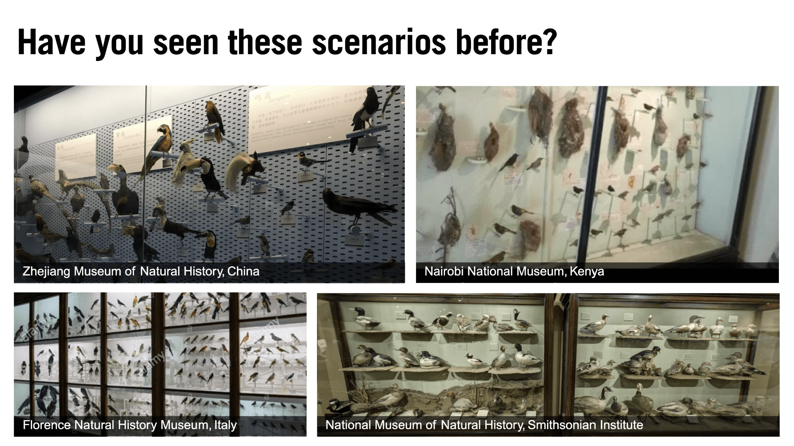
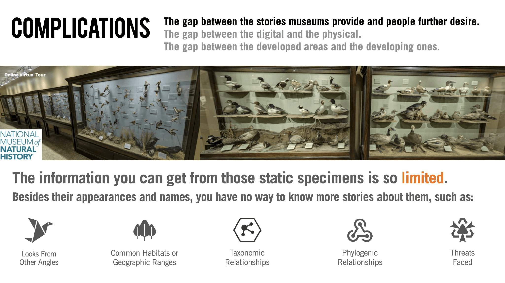 | 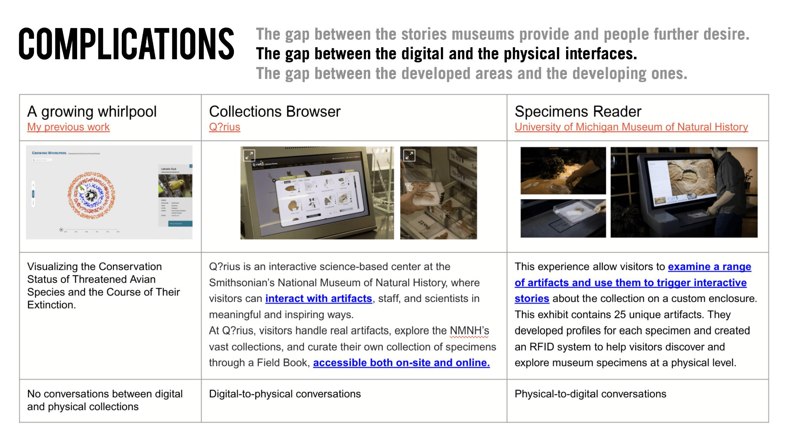
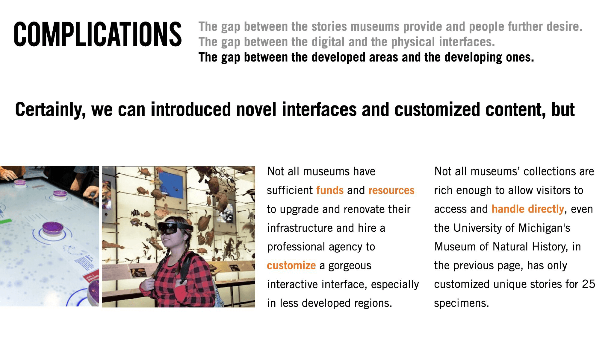 | 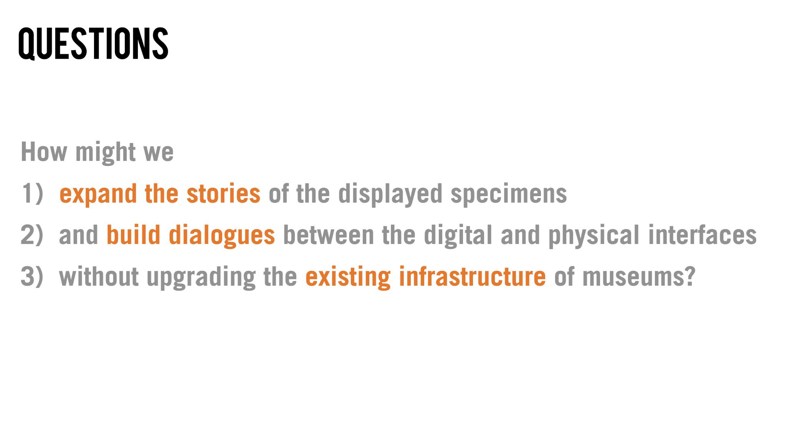
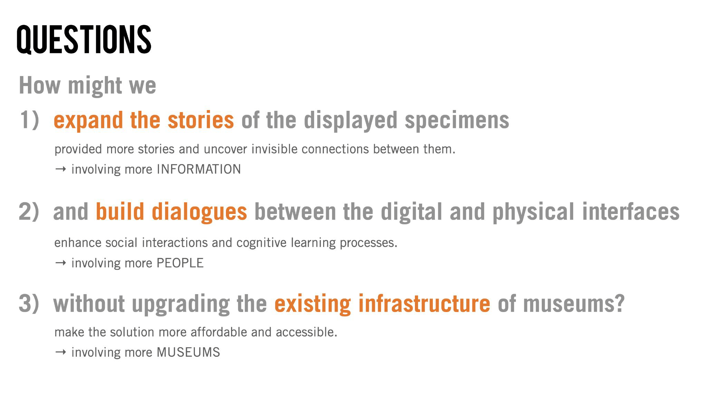 | 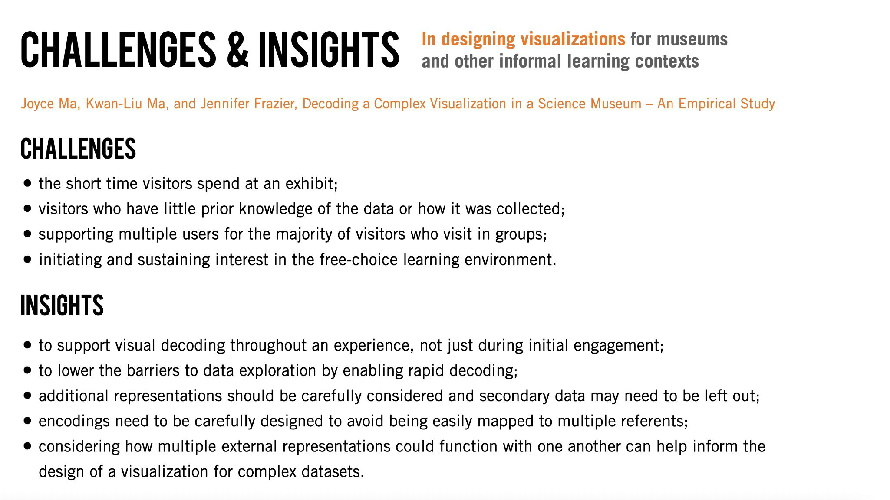
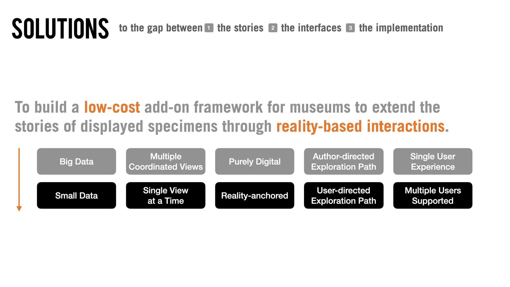 | 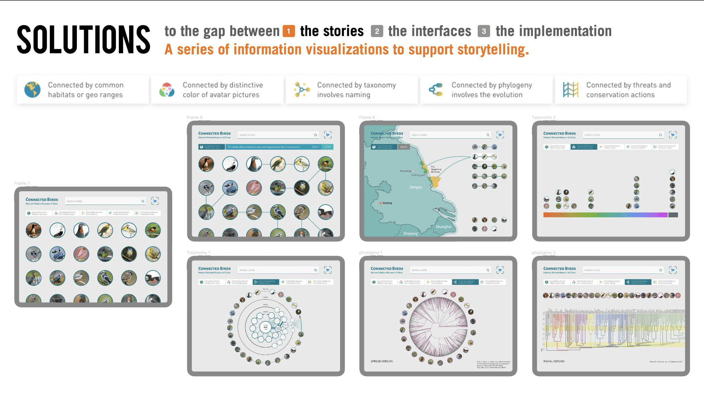
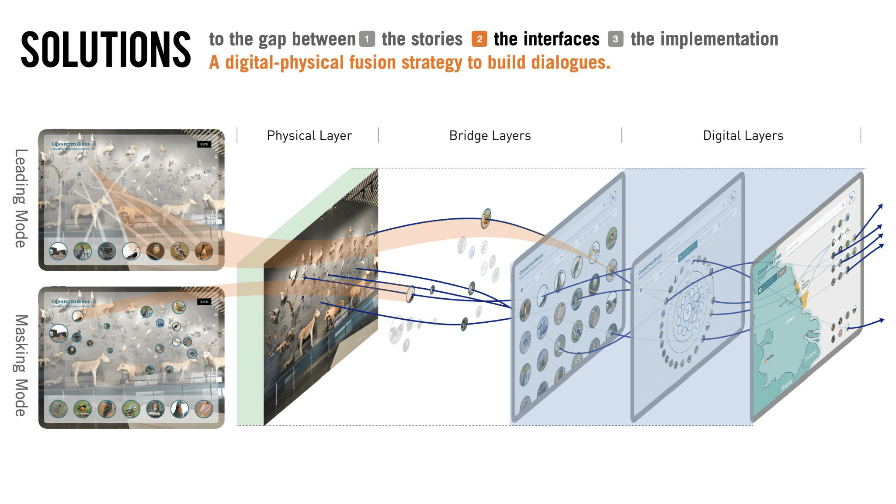 | 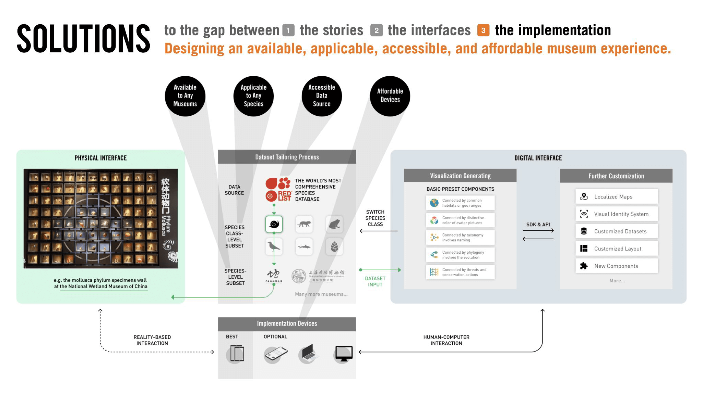

#### Feedback

- **Shannon Mattern**

    What a beautiful slide show, Zhibang! It’s clear that a great deal of careful thought and interdisciplinary research — across data science, exhibition design, qualitative methods to study the *reception* of information visualization, etc —  informed your work. I love how your project aims to expand the “maps” of these collections in myriad dimensions: enhancing the ways metadata can map individual specimens and their collections; enhancing the ways visualizations can allow visitors *access* to that additional contextualizing information; and expanding the scope of institutions who can take advantage of such tools *without* requiring expensive infrastructure upgrades. While you stated up-front hat your project is “not an atlas,” there are so many “atlas-like” things that inform this work: it’s atlas-like in its presentation of multiple modes of expression / visualization in order to provide multiple modes of engagement with a theme / topic / specimen. What’s more your modeling of layers suggests both technical and rhetorical structures — from the layered “technical stack” that makes such data infrastructures possible, to the layers of information that visitors can “dig into” to satisfy their curiosity — that characterize maps, too. I also greatly appreciate the ethical commitment to accessibility and knowledge sharing that permeates your project. You shared some beautiful visualizations that manifested a lot of the critical concepts informing your work. I would’ve loved to hear more about how those “bridge layers” work — and what it means both methodologically and metaphorically to *bridge* in this project!
- **Chat Comments**
  - Shannon Mattern: I know you stated that you’re not making at “atlas,” Zhibang - but your’e incorporating so many rhetorical and epistemological principles of the atlas: deploying diverse strategies of mediation / argumentation in order to provide a prismatic overview / analysis of a subject. I also really appreciate the democratizing / accessibility mission behind Zhibang’s project
  - Cate Morley: Very cool, Zhibang. And beautiful graphic demonstrations!
  - Anna Gedal: Zhibang, it’s so nice to meet another student working in this space! I’ve worked for around 5 years, creating these types of experiences for museums. Few institutions create them on their own, they normally hire museum consulting firms with specialized skills to build them. The costs are high. Even a basic touchscreen kiosk can cost over $1M, so many institutions cannot afford it. More broadly, most institutions do not have the tech infrastructure to support tech. Christiane Paul writes a lot about this in her work with the Whitney (she’s in the Media Studies )
  - Sherry Manzar: This is such an amazing outlook into the questions around what a collection is and can be. Really well-done!
  - Oscar Fossum: Everyone appreciates an interactive museum exhibition. I love being able to deep dive on a single presentation. Your work could provide “thick descriptions” to go deeper into the histories and connections between museum-things! Awesome, Zhibang!

#### Thoughts on Final Touches

##### Narratively thematic navigations through the collection

1. Theme-related navigating options
2. Preset stories of selected species with captions as the guidance for atlas visitors

##### Transitions as the connective threads between individual maps

1. How transition enhance the human perception and cognition

##### Descriptive commentary reflecting on the mission of each map

##### Accessories to enhance the self-explanatory and intuitive features of the atlas

1. Add more hints or signifiers for user interactions
2. Introduce Naïve Analogy1 methodology for non-professional users
3. Use the splash page as prefaces; add legends and citations for the data

##### Expanding accessibility for scenarios

1. Provide the simulation of the in-person experience in the cyberspace
2. Provide home-based experience using learning kits as the analog of the museum settings for kids

#### Indivisual Meeting Feedback for Final Touches

1. One thing I'd really love to hear is how some of the thoughts, concepts, critical issues and our discussions we've talked about this semester have informed your work. Maybe that's something you would actually incorporate into your formal thesis video too.
2. It's ok to be work-in-progress. And also there's no the divine law that says taht all work has to be finished to 15 week semesters. It's alright what you submit is some parts of it fleshed out, others you mentioned future plans.

### References

#### Histories of Natural History (Museums), Cultures of Display

- Asma, Stephen T. Stuffed animals & pickled heads: The culture and evolution of natural history museums. Oxford University Press, USA, 2003.
- Hooper-Greenhill, Eilean, ed. Museum, media, message. Routledge, 2013.
- Turner, Hannah. Cataloguing Culture: Legacies of Colonialism in Museum Documentation. UBC Press, 2020.

#### The History of Museum Technology

- Thorburn, David, and Henry Jenkins, eds. Rethinking media change: The aesthetics of transition. Mit Press, 2004.
- Griffiths, Alison. Shivers down your spine: Cinema, museums, and the immersive view. Columbia University Press, 2008.

#### Museum Technique + DataVis

- Ma, Joyce, Kwan-Liu Ma, and Jennifer Frazier. "Decoding a Complex Visualization in a Science Museum–An Empirical Study." IEEE transactions on visualization and computer graphics 26, no. 1 (2019): 472-481.
- Hinrichs, Uta, Holly Schmidt, and Sheelagh Carpendale. "EMDialog: Bringing information visualization into the museum." IEEE transactions on visualization and computer graphics 14, no. 6 (2008): 1181-1188.
- Horn, Michael S., Brenda C. Phillips, Evelyn Margaret Evans, Florian Block, Judy Diamond, and Chia Shen. "Visualizing biological data in museums: Visitor learning with an interactive tree of life exhibit." Journal of Research in Science Teaching 53, no. 6 (2016): 895-918.
- Grinter, Rebecca E., Paul M. Aoki, Margaret H. Szymanski, James D. Thornton, Allison Woodruff, and Amy Hurst. "Revisiting the visit: Understanding how technology can shape the museum visit." In Proceedings of the 2002 ACM conference on Computer supported cooperative work, pp. 146-155. 2002.
- 刘健. "博物馆数据可视化的探索与实践——以上海博物馆数字化建设为例." 收藏 2 (2019).

#### Cognitive Learning

- Hofstadter, Douglas R., and Emmanuel Sander. Surfaces and essences: Analogy as the fuel and fire of thinking. Basic Books, 2013.

#### Case Studies

- [Unlikely Avian Taxonomies](https://zoesadokierski.com/exhibitions/unlikely-avian-taxonomies)
- [Handbook of the Birds of the World Alive](http://www.birderslibrary.com/reviews/other-reviews/hbw_alive.htm)
- [HEADHUNT, National Portrait Gallery, Australia](https://www.portrait.gov.au/content/headhunt)
- [SMARTIFY: Explore a world of art and culture](https://smartify.org/)
- [Lessons in bringing birds to life: an Augmented Reality experiment at the Museum of Natural History](https://medium.com/neeeu/lessons-in-bringing-birds-to-life-an-augmented-reality-experiment-at-the-museum-of-natural-history-21d2855c4c68)
- [Five Augmented Reality Experiences That Bring Museum Exhibits to Life](https://www.smithsonianmag.com/travel/expanding-exhibits-augmented-reality-180963810/)
- [Learn more about the apps offered by the American Museum of Natural History.](https://www.amnh.org/apps)
- [How museums are using immersive digital experiences (pre- and post-pandemic)](https://econsultancy.com/how-museums-are-using-immersive-digital-experiences/)
- [the work Seb Chan has done at the Cooper Hewitt and the Australian Center for the Moving Image](https://sebchan.medium.com/)
- [BLOGS FROM THE NATURAL HISTORY MUSEUM](https://naturalhistorymuseum.blog/category/digital-media-at-the-nhm/)
- [the syllabi for Elaine Ayers’ classes](https://elaineayers.com/Work)

#### D3 or other examples

- [Radial Tidy Tree by Muhammad](https://observablehq.com/@muhammad-usman17/radial-tidy-tree)
- [Radial Tidy Tree by Evgenia](https://observablehq.com/@joi-joe-joy/radial-tidy-tree)
- [Beautiful Family Tree](https://familyhistorydaily.com/genealogy-help-and-how-to/family-tree-charts/)
- [force layout](https://www.d3indepth.com/force-layout/)
- [Quadtree Brush](https://observablehq.com/@d3/quadtree-brush)
- [Quadtree Brush optimization](https://observablehq.com/@bmschmidt/quadtree-brush-optimization)

#### Field Knowledge

- [Is gaining over 1000 new bird species a problem for conservation?](https://www.birdlife.org/worldwide/news/gaining-over-1000-new-bird-species-problem-conservation)
  
## Implementation

### Pipeline

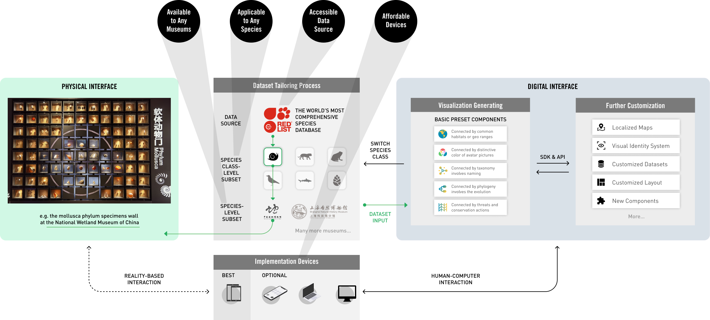

### Layered Interfaces

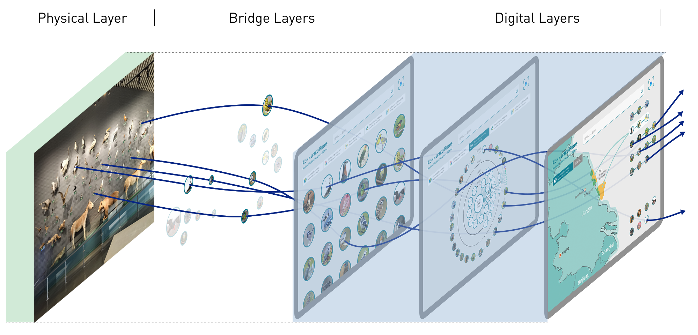

### The Gallery View

The gallery view is digital replication of the exhibits at a real museum, meaning the dataset is constructed based on those exhibits, and the items in this Gallery View are exactly same as those.

#### Macro Level: Overview

**Progress until Apr 8**

##### Design Review

This view utilizes the power of small multiples and provides vistors an opportunity to reorganize the static museum species through preset dimensions that could be color encoded in the stroke of the item, forming an augmentation of the in-person exhibits.

##### Development Process

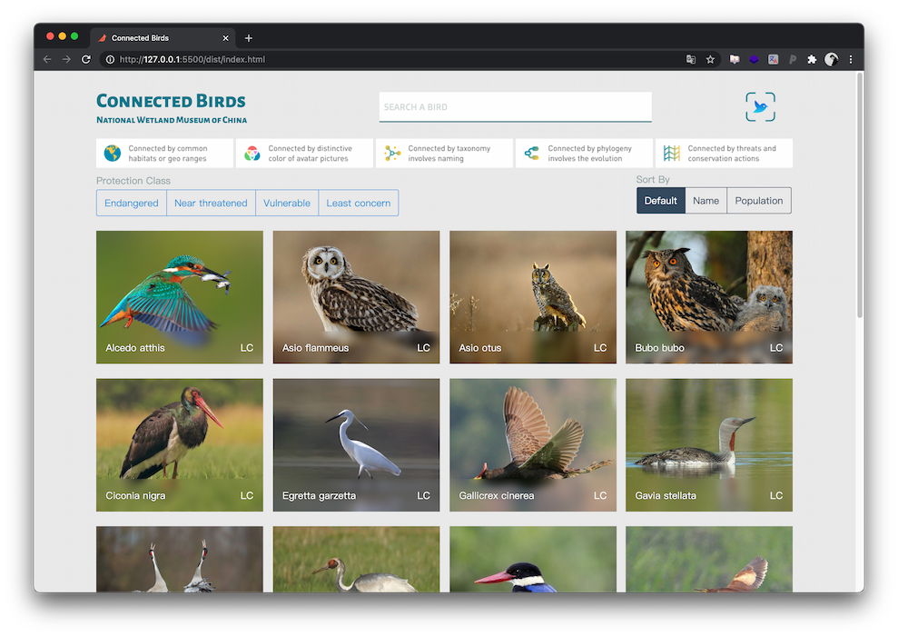
I built a sortable and filterable grid of items using [Shuffle.js](https://vestride.github.io/Shuffle/). The tentative filter dimension is the *Protection Class* (conservation status). And the planned *Sort By* dimensions would be:

- Alphabet
- Population (data deficient)
- Feather Color
- maybe the *Protection Class* (could be merged into *Sort By*)

In addition, the ultimate appearance of items shoud be circles insdead of rectangles.

##### Individual Meeting Feedback

#### Micro Level: Details-on-demand

**Progress until Apr 15**
In this step, my goal is to develop a clickable feature of each item - species. This feature would allow users to enter the detailed view of each species. When a user click a species in the gallery view, two actions would happen:

- A panel will float from the right side of the screen.
- The layout of the items will be transformed into non-hierarchical packed circles.

##### Design Review

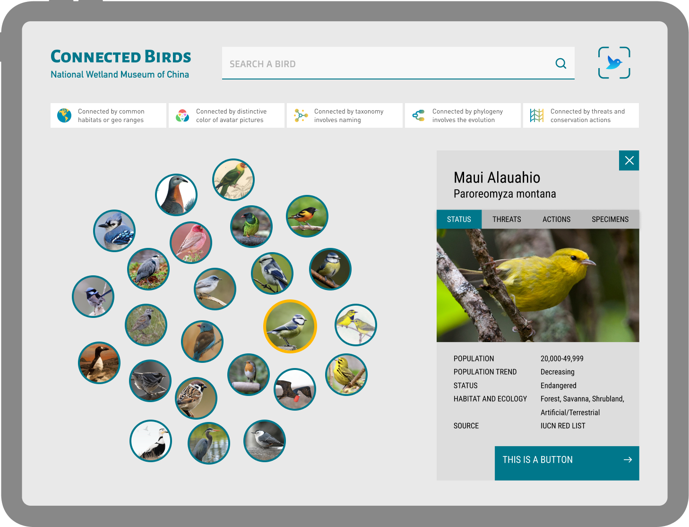

##### Development Process

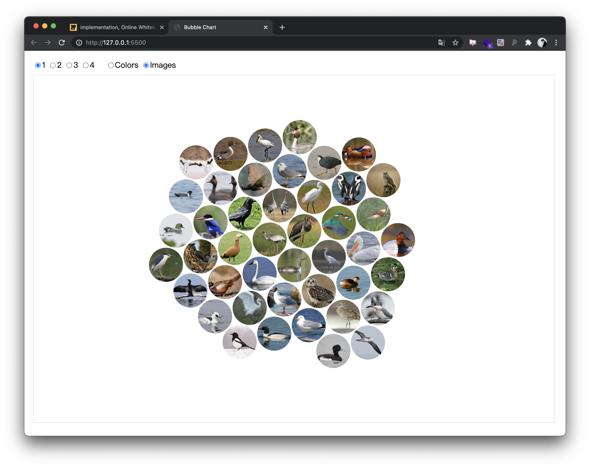
<!-- 
In short, there are challenges in this step: 
1. build a force layout
2. insert images in each node
3. create a transition between the overview and the force layouts
4. attach `on` event listeners to the `circle` variable to trigger the panel.

Towards these challenges, I found several cases and tutorials that could be helpful. 
1. The non-hierarchical packed circles could be realized via [D3 Bubble Chart](https://observablehq.com/@d3/bubble-chart) and [D3 Force Module](https://github.com/d3/d3-force).
2. [Forcing Functions: Inside D3.v4 forces and layout transitions](https://hi.stamen.com/forcing-functions-inside-d3-v4-forces-and-layout-transitions-f3e89ee02d12)
3. [Create a Node Network Graph with D3.js](https://sylhare.github.io/2020/05/21/Node-network-graph-d3.html)
4. [How to Make Interactive Bubble Charts in D3.js](https://www.webtips.dev/how-to-make-interactive-bubble-charts-in-d3-js)
5. [Fun with D3js: Data Visualization Eye Candy + Streaming JSON](https://www.pubnub.com/blog/fun-with-d3js-data-visualization-eye-candy-with-streaming-json/)
6. [major-studio-1-fa20/lab06_images/](https://github.com/readyletsgo/major-studio-1-fa20/tree/master/lab06_images) -->

###### Notes in process <!-- omit in toc -->

1. [Data binding after v5](https://www.createwithdata.com/d3-has-just-got-easier/).

##### One-on-one Feedback

##### Guest Feedback

- Constancy of species when views change: add transitions
- connection to chart in spread version: hover or click ➡️ links
- <https://merlin.allaboutbirds.org/> ➡️ color sorting
- Consider stroke in grid view to become categoric color.

## More Feedback

### Final review feedback

**Ellie:**

1. Back to this podcast that I listened to about how trees are connected. Through their roots and so I was thinking it would be some sort of mental connection thing. So I don't know if I ever heard you actually say **what connection means** in the context of your database. And I think that would be an important thing to **put at the forefront of your presentation**.
2. And the last slide where you talk about the solutions for all museums. Felt disconnected from your database. I know it can be important to talk about how valuable this technology is. But it didn't feel like the core of what you're trying to say with your DataVis is and could be bossibly moved up so that you end on - this is the connection of this database, and this is how this can be visualized rather than the technonoly.

**Alec:**

1. Most of my suggestions are about pacing. Maybe you don't need captions on every screen, but you should think about what screens are important to have your text exactly as you want it and which screens you maybe want to leave a little bit space so you can catch up if you need to.
2. Maybe set the context of "this is a potential tool for especially a museum that doesn't have the resources to build their own fancy technology" earlier. I though that was a really interesting way to provide context but you mentioned it most of the way through the presentation.

**Daniel:**

1. The production has closed captioning.
2. Give the moment for diagrams to talk for itself. What's going on with these diagrams. We are looking at things and you're with us as the guide.

### MTF class

#### Breakout rooms in the final class

- Blake: Are you planning on or have you already sent this to a museum as a real exhibit?

- Me: Yes. At this stage I take the exhibits in the National Wetland Museum of China as my basis or the starting point. Next step I would involve more species and museums. Also user studies would be conducted.

Galen: It adds so much of life to those animals that have been stuffed in museums. It's a funny way of putting it but you can go on this App and you can see all sorts of information. It makes me feel like I'm an ornithologist even though I know almost nothing about birds. So much more interactive in a way that you're not getting rid of an exhibit but you're making it a lot more elaborate.

#### Shannon: Final Atlas Feedback

I want to repeat my earlier praise for the ethical commitments underlying this work: the fact that you want to develop tools that pool the resources of museums so all can benefit, especially less-well-resourced institutions. What you’re offering won’t require expensive and intensive infrastructure upgrades.

I appreciate the variety of modes of engagement — through sound, color, taxonomy, conservation status, threats + actions, and more to come — you’ve facilitated, all of which support your goals of “expanding the stories” of each displayed specimen *and* building dialogues between physical installations and digital interfaces. You’re also building dialogues between institutions and datasets and disciplinary knowledges! I mention in my audio note what particular  insights these five modes of engagement might allow — and while I realize that some are still works in progress, and I don’t quite understand how they’ll function, I do see their potential! And I’m eager to see the *new* functionality you plan to implement in future upgrades — both over the next few days and into the future. I’m especially eager to see how the panorama / AR component will further bridge physical and digital interfaces *and* how the credits and citations will root your project within a broader interdisciplinary dialogues and embody the generous, dialogic ethic that underlies your work.

### Chris Bost

#### May 7 Individual Meeting

The pace is good, and tone is natural. If leave a pause after each section to let the audience appreciate the design/UI/visual elements, the presentation could be better.

## Branding

### Keynote Video

### Landing Page

## Written Thesis
